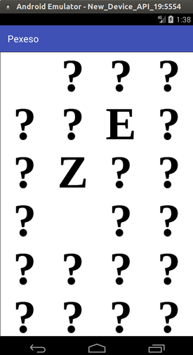
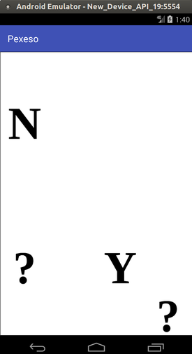

## Description

Simple implementation of the "Pairs" game, called Pexeso in czech.
Built for tutorial purposes. Letters are used as the pairs base images.

## Screenshots

 

## Build and tests

Built with Android Studio 2.3.3
Unit tests, example tests with the use of PowerMock and also example activity test.

